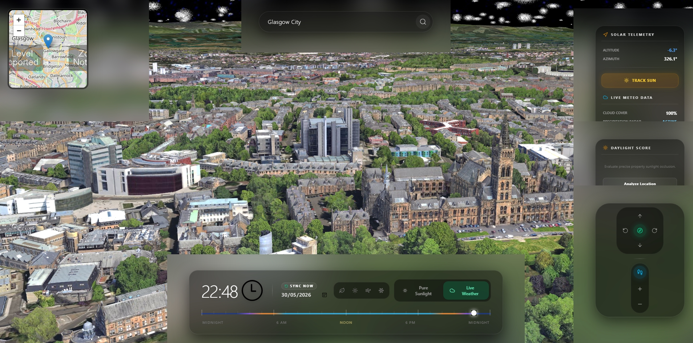

# SolarTrace

**SolarTrace** is an experimental 3D sunlight and shadow analysis tool for rental housing decisions.

I started this project because rental photos often do not show what a room actually feels like throughout the day. A place may look bright during a viewing, but the real sunlight can change a lot depending on the season, time of day, floor level, window direction, and nearby buildings.

SolarTrace is my attempt to make this part of renting easier to understand visually.

## Live Demo

👉 **Try the demo:** https://solartrace-demo.vercel.app

For the best experience, please open the demo on desktop. Mobile support is still being improved.

## Preview

## Screenshot

## Demo Video

[Watch the demo video](solartrace-assets/gifs/gif2.mp4)

## Why I Built This

When renting remotely, especially as an international student or someone moving to a new city, it can be hard to judge whether a room will actually get sunlight.

Common problems include:

- listing photos taken at the best possible time
- rooms that look bright in summer but feel dark in winter
- lower floors blocked by nearby buildings
- unclear window orientation
- not being able to visit the property in person
- difficulty comparing the real daylight conditions of different flats

SolarTrace explores how 3D maps, sun position, and time-of-day simulation could help people make better rental decisions.

## What It Does

SolarTrace allows users to preview sunlight and shadow conditions in a 3D map environment.

The current prototype focuses on:

- visualizing surrounding buildings in 3D
- showing the sun position for a selected location and time
- simulating how sunlight changes throughout the day
- giving a basic sense of nearby obstruction and shadow risk
- helping users think about daylight before signing a lease

## Current Features

- 3D city visualization
- sun position preview
- time-of-day sunlight simulation
- basic surrounding obstruction preview
- address search prototype
- desktop-first demo experience

## Planned Improvements

- clearer daylight score
- winter / summer sunlight comparison
- address-based sunlight report
- weather-aware sunlight estimate
- better mobile experience
- easier comparison between rental options
- clearer explanation of uncertainty and data limitations

## Who This Is For

SolarTrace is being built for:

- international students renting before arrival
- renters comparing apartments remotely
- people who care about natural light
- people moving to a new city
- anyone who wants to understand daylight conditions before signing a lease

## Project Status

SolarTrace is currently an early prototype.

The demo is shared mainly for feedback, testing, and discussion. Accuracy may vary depending on the available map, building, weather, and location data.

At this stage, SolarTrace should be treated as a visual reference tool rather than a final measurement product.

## Notes

This repository is a public project page for SolarTrace.

The production code, simulation details, scoring model, deployment setup, and private development files are not included here.

## Feedback

Feedback and suggestions are welcome.

You can open an issue here or contact me at:

**rhythm232@163.com**
